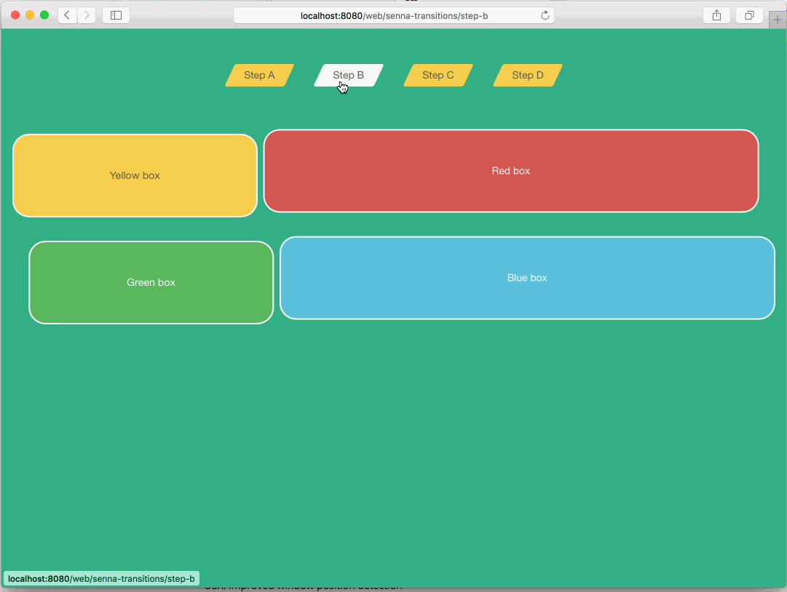

#### liferay-7-workspace


# SPA Transitions

Automagic animated transitions for your views, without writing a single line of code. Just define what becomes what and you’re good to go.



## How to animate your views

All turns around a single custom attribute to be placed on animated views: `data-senna-transition-id`.

```jsp
<%-- view.jsp --%>

<div data-senna-transition-id="blogs/1">
  <p>Some description here</p>
  <a href="view_entry.jsp?id=1">Read more</a>
</div>
<div data-senna-transition-id="blogs/2">
  <p>Some description here</p>
  <a href="view_entry.jsp?id=2">Read more</a>
</div>
<div data-senna-transition-id="blogs/3">
  <p>Some description here</p>
  <a href="view_entry.jsp?id=3">Read more</a>
</div>

<%-- view_entry.jsp --%>

<%
long id = ParamUtil.getLong(request, "id");
%>

<div data-senna-transition-id="blogs/<%= id %>">

  <h1>Watching article n. <%= id %></h1>
  <p>Lorem ipsum...</p>

</div>
```

Jumping from *view.jsp* and *view_entry.jsp* will transition the selected entry from the ‘abstract’ to the ‘detail‘ view.

### Elements with required parents

Sometimes you don’t have auto-consistent elements, for example when the ones you want to animate are part of a ‘bigger’ component.

Tipical examples are `<li>`s or Bootstrap’s `.list-group-item`s.

To solve this you can use the following custom attributes to further specify the hirearchy of your element:

- `data-senna-transition-ancestor` is a selector that searches the ancestors of the element and when finds something it uses that one as the transitioned element, removing other children and leaving the animated element alone;
- `data-senna-transition-ancestor-content-selector` searches inside the ancestor in order to find *where* to place the animated element.

## Caveats

- **Don’t use IDs to style your views.** In order for the animation to be consistent when we animate the elements we strip away every `id` attribute is present in them, children included.
- **Don’t depend on `<body>`’s or `<html>`’s classes too much in your themes and styles**, or we’ll get inconsistent layout when reading the position of elements to calculate the transition path.
- **Don’t be lazy and use fully qualified transition-ids.** While `blogs/123` is ok, `123` is not because it could collide with other animated objects transitioning between apples and oranges, if you get the point. Pedantic ids are better: `it.smc.blogs.service.models.BlogsEntry/123`.

## Known Issues

Looks like there are some issues with scrolling. We are addressing them.

## License

Without specific disclaimer, all the plugins inside this repositories are free
software ("Licensed Software"); you can redistribute it and/or modify it under
the terms of the [GNU Lesser General Public License](http://www.gnu.org/licenses/lgpl-2.1.html)
as published by the Free Software Foundation; either version 2.1 of the License,
or (at your option) any later version.

These plugins are distributed in the hope that it will be useful, but WITHOUT ANY
WARRANTY; including but not limited to, the implied warranty of MERCHANTABILITY,
NONINFRINGEMENT, or FITNESS FOR A PARTICULAR PURPOSE. See the GNU Lesser General
Public License for more details.

You should have received a copy of the [GNU Lesser General Public
License](http://www.gnu.org/licenses/lgpl-2.1.html) along with this library; if
not, write to the Free Software Foundation, Inc., 51 Franklin Street, Fifth
Floor, Boston, MA 02110-1301 USA
